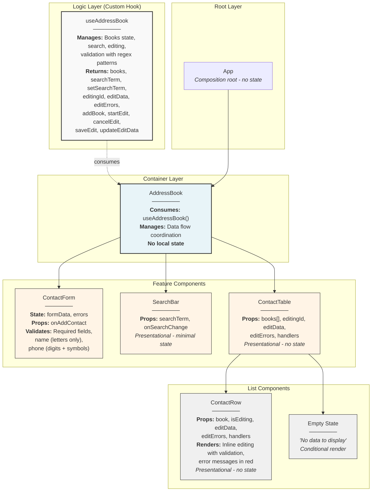

## Diagram



## Design Patterns Used in Address Book Project

### 1. Custom Hooks Pattern

**Description**: Extracting business logic into a custom `useAddressBook` hook for reusability and separation of logic from UI.

### 2. Container/Presentational Pattern

**Description**: Separating components into containers (handle logic) and presentational components (handle appearance).

**Container Component**:

```javascript
// AddressBook.jsx - handles logic
function AddressBook() {
  const { books, addBook, ... } = useAddressBook(); // logic
  return <ContactTable books={books} ... />; // passes data
}
```

**Presentational Components**:

```javascript
// ContactRow.jsx - handles appearance
function ContactRow({ book, isEditing, ... }) {
  return <tr>...</tr>; // only rendering
}
```

### 3. Composition Pattern

**Description**: Building complex UI from simple components.

**Implementation**:

```javascript
AddressBook
  ├── ContactForm
  ├── SearchBar
  └── ContactTable
      └── ContactRow (multiple)
```

### 4. Props Down, Callbacks Up Pattern

**Description**: Unidirectional data flow - data flows down via props, changes return up via callback functions.

**Example**:

```javascript
// Data down ⬇️
<ContactRow book={book} editData={editData} />

// Changes up ⬆️
<button onClick={() => onSaveEdit(book.id)}>Save</button>
```

### 5. State Lifting Pattern

**Description**: Lifting state to common parent component for synchronizing child components.

**Implementation**:

```javascript
// State lifted to AddressBook
const { books, searchTerm, editingId } = useAddressBook();

// Passed to different child components
<SearchBar searchTerm={searchTerm} />
<ContactTable books={books} editingId={editingId} />
```

### 6. Conditional Rendering Pattern

**Description**: Displaying different content based on conditions.

**Implementation**:

```javascript
{filteredBooks.length === 0 ? (
  <p>No data to display</p>
) : (
  <table>...</table>
)}

{isEditing ? (
  <input ... />
) : (
  book.firstName
)}
```

### 7. Single Responsibility Principle

**Description**: Each component responsible for one specific function.
**Examples**:

-   `ContactForm` - only adding contacts
-   `SearchBar` - only search functionality
-   `ContactRow` - only displaying/editing one row
-   `useAddressBook` - only data management

### 8. Validation Pattern

**Description**: Centralized validation using regex patterns.

**Implementation**:

```javascript
const validateForm = (data) => {
    // Name validation - only letters
    if (!/^[a-zA-Z\s]+$/.test(data.firstName)) {
        errors.firstName = "Only letters allowed";
    }
    // Phone validation - digits and symbols
    if (!/^[\d\s\-\+\(\)]+$/.test(data.phone)) {
        errors.phone = "Invalid phone format";
    }
};
```
